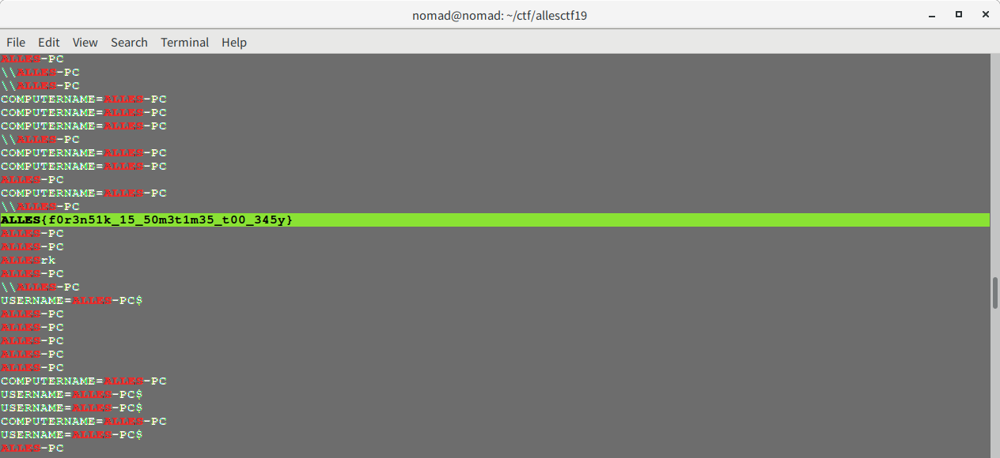
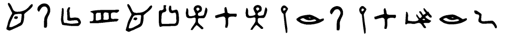
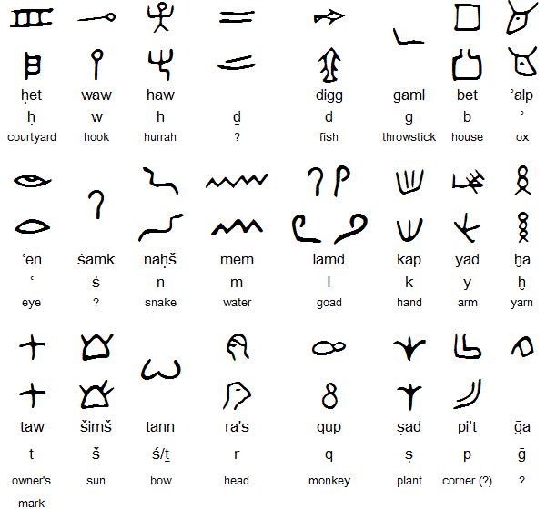

# Chaos-Communication-Camp-2019 writeup

## 1. FlagConverter 1 (forensics, 43)

On the campground of the CCCamp, someone is trying to troll us by encrypting our flags. Sadly, we only got the memory dump of the PC which encrypted our flags.
Please provide us with the flag which is not yet encrypted.

*flagconverter.7z*

### Solution:

The attached archive contains a huge memory dump *flagconverter.dmp* (1.1Gb).
The easiest thing to do is to run the following command implying that the flag has the format of ALLES{...}:

```$ strings flagconverter.dmp | grep ALLES```

The output gave us the flag:



## 2. Ancient Data (misc, 90)

That is some ancient stuff! Could you translate that for us?



Put your translated text in the following format, to submit the Flag: ALLES{'<'translated text">"}

### Solution:

First I cut the image into pieces each of which contained a single glyph and googled by image.
After 10 minutes of searching I found that those symbols are from Proto-Sinaitic alphabet (https://en.wikipedia.org/wiki/Proto-Sinaitic_script). So it's easy to recover latin letters from them symbol by symbol. I also found a great picture:



Recovered text: ```alphabetevolution```

And the flag is: ```ALLES{alphabetevolution}```


